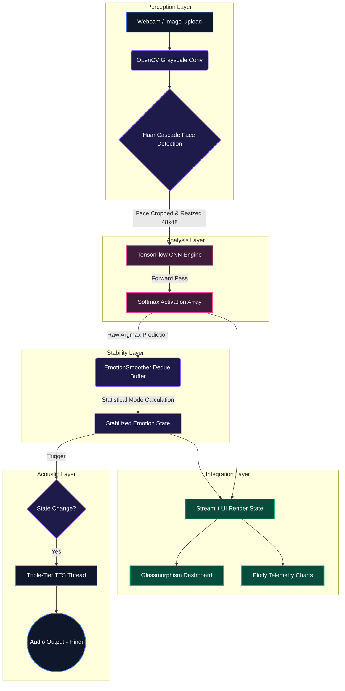

# 🧠 AI Emotion Detection System (Cortex-V) - Technical Deep Dive

## 📘 Comprehensive Introduction

**Cortex-V** is an advanced, high-performance **Facial Emotion Intelligence System** architected to fluidly bridge the communication gap between human sentiment and machine perception. Conceptualized around the philosophy of *"AI Jo Dil Ki Baat Jaan Le"* (Artificial Intelligence that understands what is in your heart), Cortex-V goes far beyond standard computer vision demonstrations. It is a full-fledged, multi-layered application that integrates a meticulously trained Deep Convolutional Neural Network (CNN) with a hyper-futuristic, highly immersive **Glassmorphism web interface** and a deeply empathetic **Triple-Tier Localized Hindi Voice Assistant**. 

At its core, Cortex-V operates in real-time. Whether ingesting live video streams at 60 Frames Per Second (FPS) or analyzing high-resolution static imagery, the system rapidly isolates human faces in complex environments, mathematically normalizes these captures, and interprets subtle muscle micro-expressions—such as the slight curvature of a lip or the furrowing of a brow—mapping them instantly into one of seven distinct emotional classifications: **Angry, Disgust, Fear, Happy, Neutral, Sad, or Surprise.**

To achieve true seamlessness and prevent the chaotic UX disruption known as "label flickering" (a common flaw in raw ML vision systems where predictions randomly oscillate between classes frame-by-frame), Cortex-V employs a custom **Temporal Smoothing AI Layer**. Paired with a fully asynchronous acoustic engine that prevents audio generation from blocking the visual rendering loop, the application delivers a smooth, unbroken, and cinematic user experience worthy of modern SaaS platforms.

---

## ✨ End-to-End Working Features

Cortex-V is divided into several highly cohesive feature modules, each tailored to deliver precise emotional insights to the user.

### 1. 📷 Real-Time Live Emotion Scanner (Webcam Engine)
The Live Emotion Scanner is the flagship feature of the application, designed for zero-latency, locally processed perception.
- **High-Speed Hardware Interfacing**: Streams directly from the system's primary camera or external webcam via OpenCV pipeline optimization.
- **Dynamic Face Tracking**: Instantly draws precise bounding boxes around detected faces in the frame.
- **Futuristic HUD Overlay**: Instead of generic debug text, the scanner overlays a "Cybernetics HUD" on the subject, showing the dominant emotion and real-time confidence probability percentages mathematically integrated into the video feed.
- **Multi-Face Capable**: Engineered to detect and compute emotions for multiple subjects simultaneously within the same frame.

### 2. 🖼️ Deep Static Image Emotion Analysis
Designed for precise examination of specific moments captured in time.
- **Format Agnostic**: Accepts standard image formats (JPG, JPEG, PNG) up to high resolutions.
- **Batch Processing Emulation**: Rapidly scans the image, isolating all present faces regardless of lighting conditions or facial angles (within the Haar Cascade threshold).
- **Insight Generation**: Not only does it label the emotion, but it also generates a specific psychological "Cortex-V Insight" based on the findings, offering advice or observations.

### 3. 📉 Live Diagnostics & Advanced Telemetry Analytics
To provide analytical depth to the raw predictions, Cortex-V incorporates a suite of interactive, real-time data visualization dashboards.
- **Live Emotion Probability Bars**: Real-time CSS-animated progress bars showing the exact softmax percentage breakdown of all 7 emotional classes simultaneously. If the model is 85% Happy and 15% Surprise, the user sees exactly this distribution.
- **The Stability Score Gauge**: A custom circular gauge chart (built with Plotly) that calculates the temporal consistency of the user's emotional state. High variance in emotions lowers the score, while sustained, readable emotions keep the score near 100%.
- **Historical Emotion Timeline**: An area chart visualizing the user's emotional journey over the past 5 minutes, allowing for retrospective psychological analysis of a session.
- **Contextual Notifications**: Real-time empathy notifications (e.g., "We detected a dip in your mood. Take a deep breath.")

### 4. 🔊 Triple-Tier Localized Voice Empathy Engine
A foundational capability of Cortex-V is its ability to speak back to the user intuitively, respectfully, and in the localized Indian context (Hindi/Hinglish).
- **Asynchronous Execution**: Unlike naive TTS implementations that freeze the camera feed while the computer speaks, Cortex-V's voice engine spins up independent daemon threads. The visual loop continues at 60 FPS while the audio generated plays in the background.
- **Debounced Triggering**: The AI is programmed not to chatter constantly. It only speaks when a statistically significant shift in emotion is registered and sustained, avoiding annoyance.
- **The Fallback Acoustic Chain**: To guarantee 100% uptime, the audio subsystem utilizes a three-tier fallback mechanism:
  - *Tier 1 (Premium Cloud)*: ElevenLabs API for hyper-realistic, human-like cadence.
  - *Tier 2 (Standard Cloud)*: Google Text-to-Speech (gTTS) for highly accurate Hindi pronunciation.
  - *Tier 3 (Offline Engine)*: `pyttsx3` native system voices as an ultimate offline failsafe.

### 5. 🎛️ AI Control Center (Sidebar Customizations)
The user holds total control over the system's behavior via a deeply customized, dark-mode Streamlit sidebar.
- **Acoustic Toggles**: Instantly disable or enable the Voice Feedback loop.
- **Sensitivity Sliders**: Modify the temporal smoothing window size interactively. A higher sensitivity reacts instantly to micro-expressions, while a lower sensitivity waits for a sustained facial expression before changing the prediction.
- **Resolution Emulation**: Toggle different UI states to match expected hardware constraints.

---

## 🛠️ Detailed Tech Stack & Functional Roles

Cortex-V is built on a modern, Python-exclusive technology stack, leveraging distinct libraries for their specialized strengths.

### 🎨 1. Frontend & UI Subsystem
- **Streamlit**: Serves as the core web application framework. Streamlit was chosen for its unparalleled ability to rapidly bridge Python backend logic (like OpenCV loops) directly to a React-based web frontend without writing boilerplate API layers.
- **Raw CSS Injection (Glassmorphism)**: Standard Streamlit widgets are visually basic. Cortex-V bypasses this by injecting hundreds of lines of raw CSS. This custom stylesheet forces a dark-mode galaxy aesthetic, utilizes `backdrop-filter: blur(12px)` for frosted glass panels, introduces custom Google Fonts (`Outfit` and `Inter`), and styles sliders and buttons to look like a premium SaaS product.
- **Plotly (`plotly.graph_objects`)**: The engine behind the interactive charts. Plotly is used to render the Stability Gauge and the Emotion History Area Chart, providing smooth SVG rendering that responds natively to dark mode.
- **Lucide Icons**: Modern, scalable vector icons injected via a lightweight CDN directly into the DOM to provide visual anchors for UI elements.

### 🧠 2. Deep Learning & Computer Vision Core
- **OpenCV (`cv2`)**: The foundational vision library. OpenCV handles the low-level hardware communication to the webcam, captures the raw `numpy` arrays representing each frame, executes high-speed color space conversions from BGR to Grayscale, and runs the `haarcascade_frontalface_default.xml` algorithm to draw bounding boxes around human faces in milliseconds.
- **TensorFlow & Keras**: The backbone of the project's intelligence. Keras is used to load the pre-trained `.h5` model file. It receives normalized `48x48` tensors representing cropped faces and runs them through a Deep Convolutional Neural Network (CNN). The culmination is a Softmax activation layer that outputs an array of seven probabilities.
- **NumPy & Pandas**: Essential mathematical libraries used for rapid matrix reshaping, array normalizations, and calculating standard deviations on the fly to fuel the Stability Score algorithm.
- **Pillow (PIL)**: Used specifically in the Static Image Analysis tab to safely handle, decode, and transpose arbitrarily uploaded image file formats into NumPy arrays that OpenCV can process.

### 🗣️ 3. Acoustic & Interaction Subsystem
- **ElevenLabs API**: Integrated via their Python SDK, this provides the highest tier of text-to-speech generation, offering breathtakingly natural voices (when an API key is provided).
- **gTTS (Google Text-to-Speech)**: Utilizing Google's translation and speech engines, gTTS natively handles Hindi phonetics (`lang='hi'`), generating temporary `.mp3` files of the AI's responses.
- **Pygame / Playsound**: Specialized audio playback libraries used to trigger the MP3 files generated by gTTS without launching external media players, keeping the user entirely within the Cortex-V interface.
- **pyttsx3**: The offline failsafe. Since it binds directly to Windows SAPI5 or macOS NSSpeechSynthesizer, it uses zero network bandwidth and guarantees the AI can speak even without an internet connection.
- **Python `threading` Module**: Crucial for UX. Implements `Daemon threads` and `threading.Lock()` to ensure that compiling text-to-speech audio files and waiting for playback completion never artificially pauses the heavy visual `while` loop powering the webcam.

---

## 🏗️ Technical Architecture (Layer by Layer Visualization)

Cortex-V is designed with a strict Separation of Concerns (SoC). The architecture is divided into five distinct operational layers.

### 1. Perception Layer (Vision Engine)
- **Component**: `src/webcam.py`
- **Execution**: The process begins by interfacing with the camera hardware. Because deep learning models are computationally expensive, processing the entire 1080p frame is inefficient. Instead, OpenCV converts the 3-channel (RGB/BGR) frame into a 1-channel Grayscale frame. Discarding color data drastically reduces the computational footprint while maintaining the edge/shadow data vital for facial recognition. The Haar Cascade algorithm slides over this grayscale image, isolating the specific Region of Interest (ROI)—the face.

### 2. Analysis Layer (Deep Learning Core)
- **Component**: `src/predictor.py` and `models/emotion_model.h5`
- **Execution**: The isolated ROI is surgically cropped from the frame. The CNN model demands strict uniformity, so the crop is resized exactly to `(48, 48)` pixels. The pixel intensities (0-255) are normalized to a float scale of `0.0 to 1.0`. The tensor is reshaped to `(1, 48, 48, 1)` to simulate a batch size of one. As it passes through the neural network, Convolutional layers extract features (edges, curves), Pooling layers downsample the data to prevent overfitting, and Dense layers interpret the abstract features. The final layer outputs a 7-element array of probabilities summing to 1.0.

### 3. Stability Layer (Smoothing & Telemetry)
- **Component**: `src/smoothing.py` (`EmotionSmoother`)
- **Execution**: In raw vision tasks, a user transitioning from a smile to a frown might briefly trigger a "Surprise" prediction for 2 or 3 frames. To stop the interface from rapidly flashing different colors and labels, the `EmotionSmoother` instantiates a `collections.deque` with a fixed `maxlen` (determined by the user's Sensitivity Slider). Every frame's raw prediction is pushed into this queue. The system then calculates the statistical mode (`Counter().most_common()`) of the queue. If the queue holds `[Happy, Happy, Happy, Surprise, Happy]`, the smoother absorbs the outlier and confidently returns "Happy".

### 4. Acoustic Layer (Voice Empathy)
- **Component**: `src/voice.py`
- **Execution**: The system checks if the new *Stabilized Emotion State* is different from the previously spoken state. If true, it retrieves the corresponding empathetic Hindi response from `src/config.py`. It then requests a `threading.Lock` to ensure no two audio threads collide. It pings ElevenLabs; if that fails or is disabled, it pings Google via gTTS, saves an MP3, and triggers PyGame. If the host machine is completely offline, it dynamically falls back to the local OS speech synthesizer (pyttsx3).

### 5. Integration Layer (The Central Hub)
- **Component**: `app.py`
- **Execution**: This is the orchestrator. It manages the Streamlit continuous rerun loop. It takes the stabilized emotion, the raw probability array, and the OpenCV frame (with bounding boxes drawn on it), translates the BGR colors to web-safe RGB, and pushes them to the respective UI containers via `st.empty()`. It updates the historical arrays stored in `st.session_state` and triggers Plotly to redraw the telemetry graphs.

---

## 📊 Deep Model Specifications

The heartbeat of Cortex-V is a custom Convolutional Neural Network built with TensorFlow/Keras.

### The Training Data: FER2013
The model was trained on the benchmark **FER2013 (Facial Expression Recognition 2013)** dataset. This dataset contains over **35,000 carefully curated grayscale images** of human faces, varying heavily in age, ethnicity, lighting conditions, and occlusion (e.g., glasses, hands). Each image is uniformly 48x48 pixels and mathematically categorized into one of 7 distinct labels.

### Model Architecture Details
- **Input Topology**: `(48, 48, 1)` — A singular, grayscale spatial matrix.
- **Feature Extraction (Conv2D Blocks)**: The model utilizes sequential pairs of 2D Convolutional layers. These layers apply mathematical kernel filters across the image to detect edges, corners, and eventually complex shapes like the curve of a nostril or the slant of an eyebrow.
- **Normalization (Batch Normalization)**: Applied between layers to standardize the inputs to the next layer, drastically reducing the training time and combating the vanishing gradient problem.
- **Downsampling (MaxPooling2D)**: Reduces the spatial dimensions (width and height) of the input volume for the next convolutional layer. This makes the model translation-invariant—meaning it can recognize a smile whether it is perfectly centered or slightly skewed to the left.
- **Regularization (Dropout)**: To prevent the neural network from "memorizing" the training data (overfitting), Dropout layers randomly disable a percentage of neurons during training, forcing the network to learn robust, generalized patterns.
- **Classification (Dense / Fully Connected)**: The final abstract features are flattened into a 1D vector and passed through standard dense neural layers.
- **Output Activation (Softmax)**: The final layer consists of exactly 7 neurons. The Softmax function is applied to convert the raw numerical outputs (logits) into a probability distribution predicting:
  1. 😠 **Angry**
  2. 🤢 **Disgust**
  3. ⚡ **Fear**
  4. 😊 **Happy**
  5. 😐 **Neutral**
  6. 😢 **Sad**
  7. ✨ **Surprise**

### Compilation Metrics
- **Optimizer**: Adam (Adaptive Moment Estimation) — chosen for its efficient handling of sparse gradients in noisy problems like facial recognition.
- **Loss Function**: Categorical Crossentropy — the standard loss metric for multi-class classification, heavily penalizing the model for confident, incorrect predictions.

---

## 🚀 The Mathematical Reality of Emotion

It is important to understand what Cortex-V is actually "seeing." The AI does not feel empathy; it performs complex dimensional geometry.

When a user smiles, their *Zygomaticus major* muscle contracts, raising the corners of their mouth, and the *Orbicularis oculi* muscle contracts, creating "crow's feet" around the eyes. The camera captures these physical changes as distinct shifts in pixel intensity values (shadows becoming deeper, highlights becoming sharper). 

The CNN recognizes this precise arrangement of pixel gradients as statistically aligning with the tensor maps labeled "Happy" in the FER2013 dataset. The genius of Cortex-V lies not in feeling emotion, but in its ability to execute millions of matrix multiplications in a fraction of a second to map these visual patterns into probabilities, and then utilizing its Acoustic and UI layers to reflect human empathy back at the user.

---

## 🔮 Future Scalability & The Project Roadmap

Cortex-V is built with modularity in mind, allowing for extensive future upgrades:

- [ ] **Emotion-Driven Spotify / Media Integration**: Linking the `Stabilized Emotion State` directly to the Spotify Web API to autonomously curate and play playlists matching the user's localized mood (e.g., triggering lo-fi beats upon detecting sustained sadness).
- [ ] **Multi-Person Relational Matrix**: Upgrading the tracking logic to implement SORT (Simple Online and Realtime Tracking) object tracking. This would assign unique IDs to multiple faces in a frame, allowing the system to analyze group sentiment in enterprise settings (e.g., boardroom meeting analysis or classroom engagement metrics).
- [ ] **Advanced Edge Deployment**: Converting and quantifying the `emotion_model.h5` into a TensorFlow Lite (`.tflite`) model. This would reduce the model size by over 70%, allowing Cortex-V to be deployed entirely on edge devices, IoT hardware, Raspberry Pis, or bundled within a native Flutter mobile application.
- [ ] **Biometric Fusion**: Integrating secondary biometric inputs, such as heart rate estimation via remote photoplethysmography (rPPG) from forehead pixel variance, to corroborate the facial emotion predictions and increase absolute system accuracy to near-medical grades.
